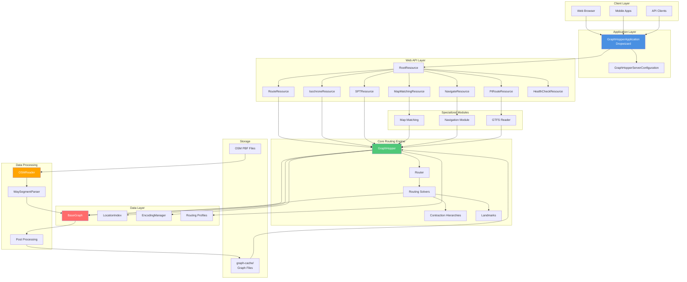
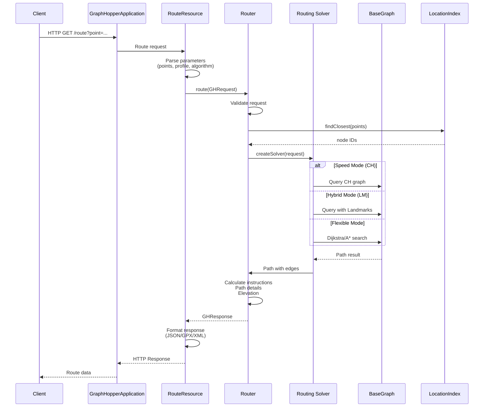
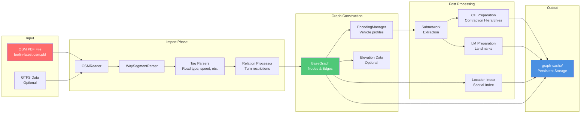
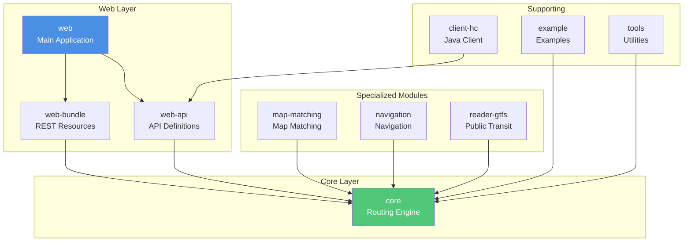
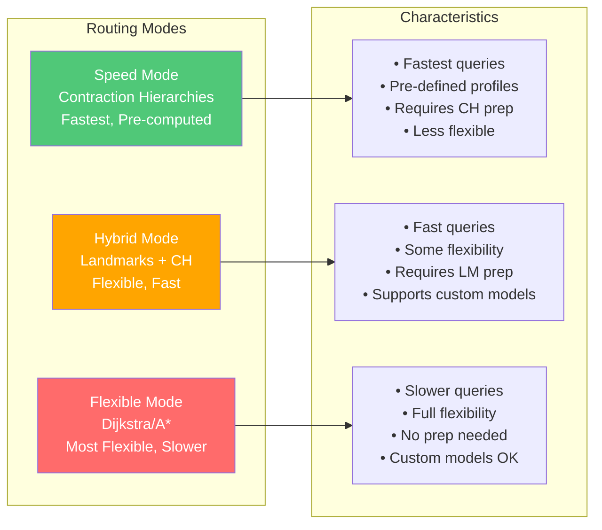
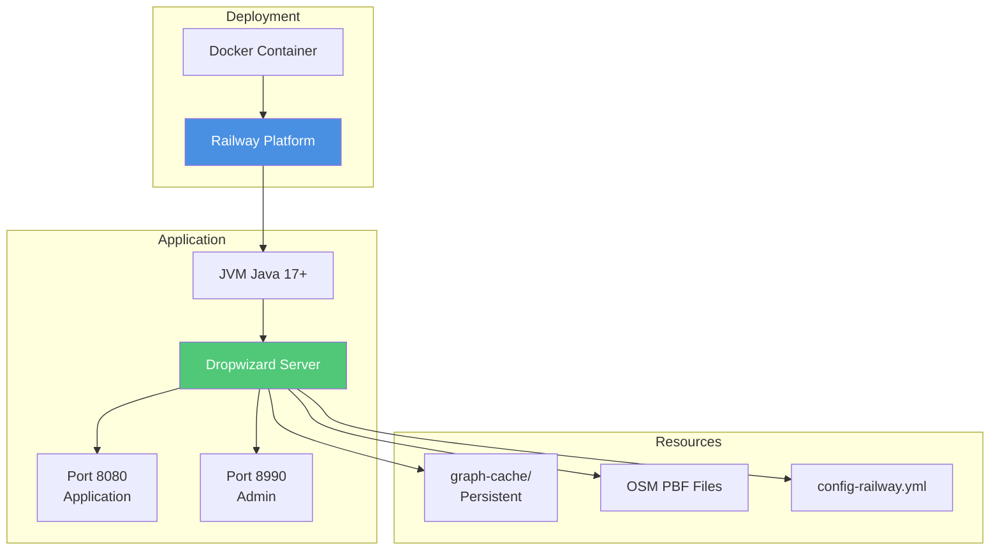

# GraphHopper Architecture Overview

## Introduction

GraphHopper is a fast and memory-efficient routing engine that calculates routes, distances, turn-by-turn instructions, and road attributes between multiple points. It can be used as a Java library or standalone web server.

## High-Level Architecture



## Request Flow Architecture



## Data Processing Pipeline



## Module Dependencies



## Routing Modes



## API Endpoints

```mermaid
graph TB
    subgraph "Core Routing"
        Route[/route<br/>Calculate route between points]
        Isochrone[/isochrone<br/>Calculate reachable areas]
        SPT[/spt<br/>Shortest path tree]
    end

    subgraph "Specialized"
        Match[/match<br/>Map matching - snap GPX to roads]
        Navigate[/navigate<br/>Mobile navigation]
        PTRoute[/route-pt<br/>Public transit routing]
        PTIsochrone[/isochrone-pt<br/>PT reachable areas]
    end

    subgraph "Utilities"
        Nearest[/nearest<br/>Find nearest point on road]
        Info[/info<br/>Service information]
        Health[/health<br/>Health check]
        I18N[/i18n<br/>Translations]
        MVT[/mvt<br/>Vector tiles]
    end

    style Route fill:#4a90e2,color:#fff
    style Match fill:#50c878,color:#fff
    style Navigate fill:#ffa500,color:#fff
```

## Component Details

### Core Components

#### GraphHopper
- Main entry point for routing operations
- Manages graph loading and initialization
- Coordinates between different modules

#### BaseGraph
- In-memory graph data structure
- Stores nodes (coordinates) and edges (road segments)
- Supports 2D and 3D (with elevation) graphs
- Memory-mapped for efficient access

#### Router
- Handles routing requests
- Validates input parameters
- Creates appropriate solver based on routing mode
- Calculates turn instructions and path details

#### LocationIndex
- Spatial index for finding nearest points on graph
- Used for snapping coordinates to road network
- Tree-based structure for fast lookups

#### EncodingManager
- Manages vehicle profiles (car, bike, foot, etc.)
- Encodes road attributes (speed, access, surface, etc.)
- Handles custom models for flexible routing

### Data Flow

1. **Import Phase**: OSM PBF files are read and parsed into graph structure
2. **Post-Processing**: Graph is optimized with CH/LM preparations
3. **Storage**: Processed graph is stored in `graph-cache/` directory
4. **Runtime**: Graph is loaded into memory for routing queries

### Key Algorithms

- **Contraction Hierarchies (CH)**: Pre-computes shortcuts for ultra-fast routing
- **Landmarks (LM)**: Uses A* with landmarks for fast flexible routing
- **Dijkstra/A***: Standard shortest path algorithms for maximum flexibility

## Deployment Architecture



## Technology Stack

- **Language**: Java 17+
- **Framework**: Dropwizard (Jersey REST, Jetty server)
- **Build Tool**: Maven
- **Data Structures**: HPPC (High Performance Primitive Collections)
- **Spatial**: JTS (Java Topology Suite)
- **Storage**: Memory-mapped files for graph data
- **Deployment**: Docker, Railway

## Performance Characteristics

- **Speed Mode**: Sub-millisecond routing queries
- **Hybrid Mode**: Millisecond-level queries with flexibility
- **Flexible Mode**: Slower but fully customizable
- **Memory**: Efficient data structures, memory-mapped files
- **Scalability**: Supports small indoor to world-wide graphs

